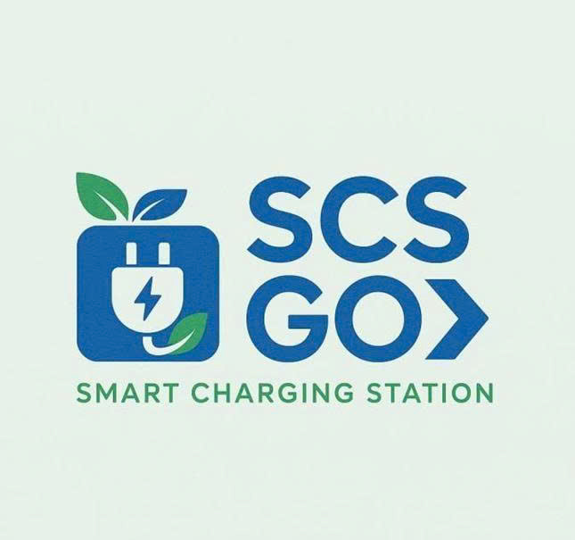

<div align="center">
  
  
  <br />
  <br />

  <h1>SCSGO | Mạng Lưới Trạm Sạc Xe Điện Toàn Diện</h1>
  
  <p>
    <b>Giải pháp tối ưu cho hành trình xanh & thông minh của bạn tại Việt Nam.</b>
  </p>

  <p>
    
    
    
    
  </p>
</div>

<br/>

## 🌟 Tổng Quan Dự Án
SCSGO Premium Landing Page là bộ mặt kỹ thuật số hoàn toàn mới được thiết kế theo ngôn ngữ **Ultra Premium** (lấy cảm hứng từ các site công nghệ hàng đầu thế giới). Chuyên trang này mang nhiệm vụ giới thiệu SCSGO - Siêu Ứng Dụng xe điện tích hợp mạnh mẽ với hiệu ứng đồ hoạ tương tác linh hoạt, chuyển động mượt mà và nền tảng thông tin vượt trội cho tài xế xe điện.

<br/>

## ✨ Tính Năng Nổi Bật Của Website
- **Fluid Aurora Background:** Nền web chuyển động dạng "chất lỏng" đa tinh thể hoà quyện siêu thực thay thế nền xám tẻ nhạt.
- **3D Interactive Tracking:** Mockup ứng dụng và các Bento Boxes tích hợp tính năng nghiêng 3D trục `rotateX/Y` chạy theo hướng trỏ chuột tạo chiều sâu rõ rệt.
- **Staggered Scroll Animations:** Văn bản, lưới tính năng, và lưới ảnh tĩnh tự động kích hoạt tiến lên bằng physics `(spring-bounce)` của _Framer Motion_ khi người dùng cuộn tới.
- **Real-World Photography:** Showcases chất lượng siêu cao (8Khz) tôn lên đặc quyền của hệ sinh thái xe điện.

<br/>

## 📱 Khám Phá App Di Động Cốt Lõi 
Đằng sau Landing Page siêu đỉnh là sức vóc thực thụ của SCSGO Mobile App - trợ lý không thể thiếu cho các tay lái xe điện Việt Nam:
* **🗺️ Bản Đồ EV Trực Tuyến:** Truy cập hơn hàng nghìn trạm sạc tại 63 tỉnh thành, trực quan với tình trạng hoạt động Live.
* **📅 Đặt Chỗ & Giữ Trạm:** Đặt thẳng chỗ sạc (đúng chuẩn CCS Type 2 / AC / DC) trên bản đồ ở các khung giờ cao điểm để không bao giờ phải chờ lâu.
* **⚡ Thanh Toán Thông Minh:** Quẹt sạc - Tự động trừ tiền chỉ qua 1 chạm thẻ tín dụng hoặc Wallet nội bộ. 
* **💬 Cộng Đồng Gắn Kết:** Tương tác, review tình trạng cây sạc hoặc đánh giá độ chill của các trạm xe điện dọc quốc lộ.

<br/>

## 🚀 Khởi Chạy Môi Trường Của Bạn

Chỉ mất vài giây để đưa toàn bộ trải nghiệm không gian tĩnh sang động trong dự án này về ngay máy cục bộ (Localhost) của bạn:

```bash
# 1. Cài đặt toàn bộ thư viện cần thiết (Node Environment)
npm install 

# 2. Dựng server phản hồi nóng ngay lập tức
npm run dev
```

> **Server tự động mở ra ở Port:** 🌐 `http://localhost:5173`
